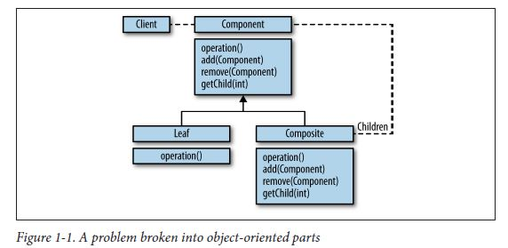
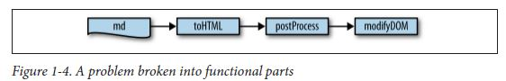
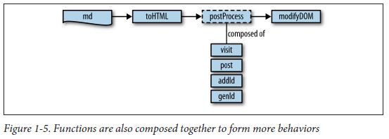
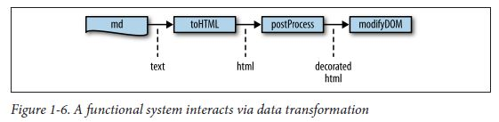

<!--Marp 0.0.11 -->
<!-- $theme: default -->

# 함수형 프로그래밍 소개

---

## 함수형 프로그래밍 이란?

프로그램을 오직 **순수 함수(pure function)** 로 구축하는 것.

순수 함수 == 부수효과(side effect)가 없는 함수.

동일한 입력값에 대해 동일한 출력을 보장하는 함수.
 
```javascript
//순수 함수
function add(a, b){
	return a + b;
}

//부수효과
var c = 1;
function add1(a, b){
	c = b;
   	return a + b;
}
````

---
## 함수형 프로그래밍은 예전에 없었나?

과거에도 있던 새로운 것이 아닙니다.

for, if문과 같은 기계적인 절차적 프로그래밍 보다, 
수학적인 개념을 활용(currying, lamda...) 사람들이 주도
실용적으로 활용 빈도는 낮음.

---
## 그럼 이제와서 왜?

멀티 쓰레드 프로그래밍의 발전
멀티 쓰레드에서는 여러 쓰레드가 같은 **State(상태)** 를 공유

**State(상태)** 는 
1. 동작이 일정하지 않음.
2. 상태를 추적하기 어려움
3. 상태에 대한 의존성으로 병렬화가 어려움.

---

## Stateless ('무'상태)

함수형 프로그래밍은 무상태를 지향

1. 무상태는 동작이나 값이 불변
2. 상태가 없는 순수 함수를 조합하여 큰 단위 함수를 만드는 방식
3. 코드의 재사용성, 조합성이 좋음
4. 상태에 의존적이지 않기 때문에 병렬화 하기 수월함

---

## 객체지향 프로그래밍에서는

문제를 부분으로 잘게 나누는 것.



---
## 함수형 프로그래밍에서는
문제를 함수형 부분으로 나눈다.


---



---



---

## 실제 코드로 비교해보면..

##### 기존 명령형 프로그래밍
```java
public class TheCompanyProcess { 
    public String cleanNames(List<String> listOfNames){
        StringBuilder result = new StringBuilder();
        for(String name: listOfNames){
            if(name.length() > 1){
                result.append(capitalizeString(name)).append(",");
            }
        }
        return result.toString();
    }

    private String capitalizeString(String s){
        return s.substring(0,1).toUpperCase()+s.substring(1,s.length());
    }
}

```

---

##### 자바8 stream을 활용한 함수형 프로그래밍
```java
public class TheCompanyProcess {
    public String cleanNames(List<String> listOfNames){
        return listOfNames.stream()
                .filter(name -> name != null)
                .filter(name -> name.length() > 1)
                .map(name -> capitalizeString(name))
                .collect(Collectors.joining(","));
    }
    
    private String capitalizeString(String s){
        return s.substring(0,1).toUpperCase()+s.substring(1,s.length());
    }
}
```